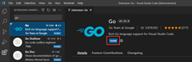
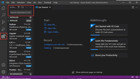
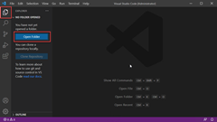
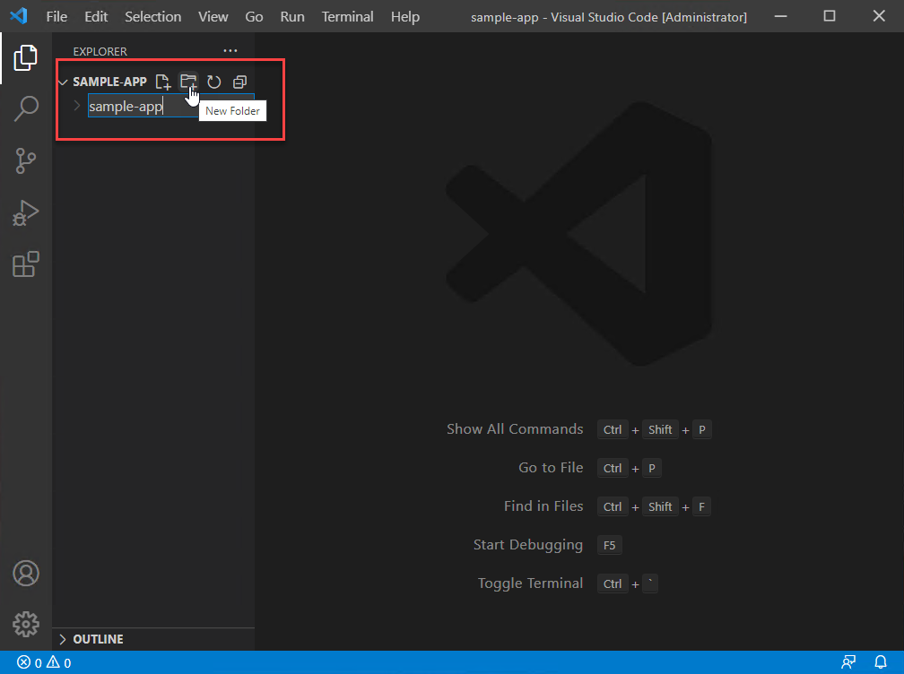
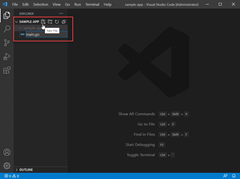
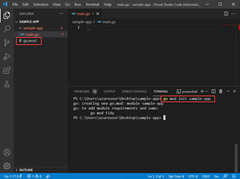
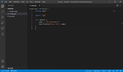
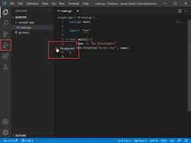

# SE-Assignment-5
Installation and Navigation of Visual Studio Code (VS Code)
 Instructions:
Answer the following questions based on your understanding of the installation and navigation of Visual Studio Code (VS Code). Provide detailed explanations and examples where appropriate.

 Questions:

1. Installation of VS Code:
   - Describe the steps to download and install Visual Studio Code on Windows 11 operating system. Include any prerequisites that might be needed.
=1. Install Go on go.dev/doc/install
 2. Install Visual Studio Code
 3. Install the Go extension.
 * 1. 
 * 2. 

 4. Update the Go tools.
 * 1. 
 * 2. 
 * 3. 
 * 4. 
 
 5. Write a sample Go program.
 * 1. 
 * 2. 
 * 3. 
 * 4. 
 * 5. 
 Sample code: package main

import "fmt"

func main() {
    name := "Go Developers"
    fmt.Println("Azure for", name)
}

 6. Run the debugger
 * 1. 
 * 2. 
 * 3. 
 Source: https://learn.microsoft.com/en-us/azure/developer/go/configure-visual-studio-code#next-steps

2. First-time Setup:
   - After installing VS Code, what initial configurations and settings should be adjusted for an optimal coding environment? Mention any important settings or extensions
= You can configure Visual Studio Code to your liking through its various settings. Nearly every part of VS Code's editor, user interface, and functional behavior has options you can modify.
VS Code provides different scopes for settings:

* User settings - Settings that apply globally to any instance of VS Code you open.
* Workspace settings - Settings stored inside your workspace and only apply when the workspace is opened.

3. User Interface Overview:
   - Explain the main components of the VS Code user interface. Identify and describe the purpose of the Activity Bar, Side Bar, Editor Group, and Status Bar.
   = At its heart, Visual Studio Code is a code editor. Like many other code editors, VS Code adopts a common user interface and layout of an explorer on the left, showing all of the files and folders you have access to, and an editor on the right, showing the content of the files you have opened.
* Activity Bar- Located on the far left-hand side. Lets you switch between views and gives you additional context-specific indicators, like the number of outgoing changes when Git is enabled. You can change the position of the Activity Bar.
* Side Bar- ontains different views like the Explorer to assist you while working on your project.
* Editor Group- The main area to edit your files. You can open as many editors as you like side by side vertically and horizontally.
* Status Bar- Information about the opened project and the files you edit.
Source: https://code.visualstudio.com/docs/getstarted/userinterface

4. Command Palette:
- What is the Command Palette in VS Code, and how can it be accessed? Provide examples of common tasks that can be performed using the Command Palette.
- The Command Palette provides access to many commands. You can run editor commands, open files, search for symbols, and see a quick outline of a file, all using the same interactive window. Here are a few tips: Ctrl+P enables you to navigate to any file or symbol by typing its name.

5. Extensions in VS Code:
   - Discuss the role of extensions in VS Code. How can users find, install, and manage extensions? Provide examples of essential extensions for web development.
- VS Code extensions let you add languages, debuggers, and tools to your installation to support your development workflow. VS Code's rich extensibility model lets extension authors plug directly into the VS Code UI and contribute functionality through the same APIs used by VS Code.

6. Integrated Terminal:
   - Describe how to open and use the integrated terminal in VS Code. What are the advantages of using the integrated terminal compared to an external terminal?
   - Visual Studio Code includes a full featured integrated terminal that starts at the root of your workspace. It provides integration with the editor to support features like links and error detection. The integrated terminal can run commands such as mkdir and git just like a standalone terminal.

7. File and Folder Management:
   - Explain how to create, open, and manage files and folders in VS Code. How can users navigate between different files and directories efficiently?
   - Create a file in VS Code
1. Open the VS Code project containing your application.
2. Click the Create File ( ...
3. Select the file group from Select File Group list.
4. Select the file type from the Select File Type list from the command palette at the top of the screen.
5. Enter a name for the file in the Create New File dialog box.
* The cd command allows you to move between directories. The cd command takes an argument, usually the name of the folder you want to move to, so the full command is cd your-directory . Now that we moved to your Desktop, you can type ls again, then cd into it.

8. Settings and Preferences:
   - Where can users find and customize settings in VS Code? Provide examples of how to change the theme, font size, and keybindings.
   *Use the Settings editor to review and change VS Code settings. To open the Settings editor, navigate to File > Preferences > Settings. Alternately, open the Settings editor from the Command Palette (Ctrl+Shift+P) with Preferences: Open Settings or use the keyboard shortcut (Ctrl+,).

9. Debugging in VS Code:
   - Outline the steps to set up and start debugging a simple program in VS Code. What are some key debugging features available in VS Code?
   *To run or debug a simple app in VS Code, select Run and Debug on the Debug start view or press F5 and VS Code will try to run your currently active file. However, for most debugging scenarios, creating a launch configuration file is beneficial because it allows you to configure and save debugging setup details.

10. Using Source Control:
    - How can users integrate Git with VS Code for version control? Describe the process of initializing a repository, making commits, and pushing changes to GitHub.
    * Pick an existing or new folder on your computer and open it in VS Code. In the Source Control view, select the Initialize Repository button. This creates a new Git repository in the current folder, allowing you to start tracking code changes. This action is equivalent to running git init on the command-line.

    My sources were Google.com , https://code.visualstudio.com/
 Submission Guidelines:
- Your answers should be well-structured, concise, and to the point.
- Provide screenshots or step-by-step instructions where applicable.
- Cite any references or sources you use in your answers.
- Submit your completed assignment by 1st July 

